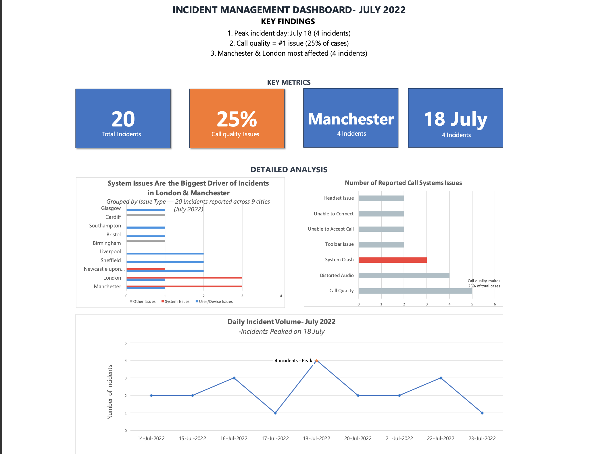

# 📊 Contact Centre Data Analysis – Springboard Project  

This project was completed as part of the **Springboard Data Analytics** program.  
It analyzes a **real-world contact centre dataset** to uncover operational insights using **SQL** (practiced on *freeCodeCamp’s SQLite environment*) and **Excel**.  

---

## 📁 Project Files  

- **SQL Queries** – `contact_centre_analysis.sql`  
  - Identify the busiest **day**, **week**, and **month**  
  - Determine the **most frequent incident types**  
  - Prepare data summaries for visualization  

- **Excel Dashboard** – `contact_centre_dashboard.xlsx`  
  - **Incident Management Dashboard (July 2022)**  
  - Highlights **incident types, peak days, and affected locations**  
  - Visual callouts for **key metrics and hotspots**  

---

## 🔍 Project Goals  

1. Find the **busiest day, week, and month** for incidents.  
2. Identify the **most common incident types**.  
3. Build a **management-ready dashboard** to highlight incident trends.  
4. Strengthen skills in **SQL querying (SQLite via CodeCamp)** and **Excel visualization**.  

---

## 🛠 Tools & Skills  

- **SQL (SQLite via freeCodeCamp)** – for practicing queries and data analysis  
- **Excel** – pivot tables, dashboards, stacked bar charts  
- **Data Cleaning** – standardizing dates, formats, and categories  
- **Data Visualization** – dashboard design with color-coded insights  

---

## 📊 Key Insights (July 2022 Dashboard)  

- 📌 **25% of incidents** were related to **call quality** (the #1 issue).  
- 📌 **Peak incident day** was **July 18** with 4 incidents reported.  
- 📌 **Manchester & London** were the most affected cities (4 incidents each).  
- 📌 **System issues** were the main drivers of incidents across locations.  

---

## 📷 Dashboard Preview  

**Incident Management Dashboard – July 2022**  

  

---

## 🚀 How to Use  

1. Clone the repository:  
   ```bash
   git clone https://github.com/Chuchunna/contact-centre-analysis.git
