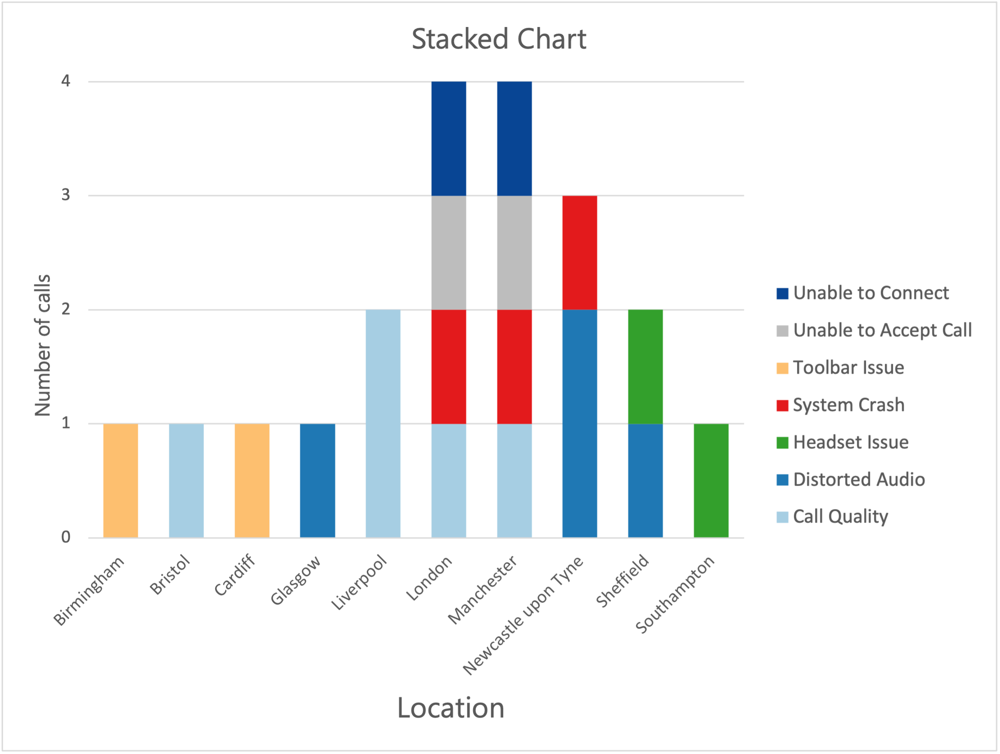

# 📊 Contact Centre Data Analysis – Springboard Project

This project was completed as part of the **Springboard Data Analytics** program.  
It focuses on analyzing a **real-world contact centre dataset** to uncover operational insights using **SQL** (DuckDB) and **Excel**.

---

## 📁 Project Files

- **SQL Queries** – `contact_centre_analysis.sql`  
  Contains queries to:
  - Identify the busiest **day**, **week**, and **month**
  - Determine the **most frequent incident types**
  - Prepare data for visualization

- **Excel Dashboard** – `contact_centre_dashboard.xlsx`  
  - Stacked bar chart showing **incident volume by location and type**
  - Pivot tables for summarizing incident data

---

## 🔍 Project Goals

1. **Find the busiest day, week, and month** for incident volume.
2. **Identify the most common incident types**.
3. Create a **stacked bar chart in Excel** showing volume & type of incidents per location.
4. Strengthen skills in **SQL querying** and **Excel visualization**.

---

## 🛠 Tools & Skills

- **SQL** – for querying CSV data directly
- **Excel** – for pivot tables, stacked bar charts, and data formatting
- **Data Cleaning** – parsing date fields, standardizing formats
- **Data Visualization** – applying color palettes for readability and accessibility

---

## 📊 Key Insights

- **System Crash** incidents had the highest volume overall.
- Certain locations consistently handled more **Unable to Accept Call** cases.
- Incident volumes peak at specific times of the year, suggesting seasonal trends.

---

## 📷 Preview

**Stacked Bar Chart (Excel)**  
*Volume & Type of Incidents per Location*



---

## 🚀 How to Use

1. Clone the repository:
   ```bash
   git clone https://github.com/YOUR_USERNAME/contact-centre-analysis.git
